[](https://git.io/typing-svg)

<div align="center">

<h3><b> 깔끔하고 직관적인 서비스 Planix </b></h3>
<p>친구들과의 일정 공유 시스템과 스케줄 관리/채팅/커뮤니티를 한꺼번에~ !</p>

</div>


---

# 🐾 목차
### 1. [프로젝트 소개](#1)
### 2. [주요 기능](#2)
### 3. [개발환경 및 기술스택](#3)
### 4. [화면 구성](#4)
### 5. [프로젝트 산출물](#5)
### 6. [컨벤션](#6)

---

## <span id="1">1. 프로젝트 소개 📝</span>

### 📍 기획 배경
- 개인 일정, 팀 일정, 할 일 관리, 채팅이 서로 다른 서비스에 흩어져 있어 한 번에 파악하기 어려운 불편함이 컸습니다.
- 스터디·프로젝트·모임에서 사용하는 캘린더, 투두 앱, 메신저를 하나로 합쳐 **“일정 · 할 일 · 채팅”을 한 화면에서 관리**할 수 있는 서비스를 만들고자 기획했습니다.

### 🎯 대상
- 스터디 / 팀 프로젝트 / 동아리처럼 **함께 일정과 할 일을 공유해야 하는 소규모 그룹**
- 개인 일정과 팀 일정을 동시에 관리하면서, **채팅으로 바로 소통하고 싶은 사용자**
- 해야 할 일을 까먹지 않도록 캘린더와 Todo, 알림을 함께 활용하고 싶은 사람

### ✅ 기대 효과
- 여러 앱을 왔다 갔다 할 필요 없이, **하나의 서비스에서 일정 · 할 일 · 채팅을 통합 관리**할 수 있습니다.
- 채팅에서 논의한 내용이 곧바로 일정·할 일로 이어져, **회의 내용과 실행 사항이 자연스럽게 연결**됩니다.
- 함께 보는 캘린더와 투두, 알림 기능을 통해 **구성원 간 일정 공유와 참여율을 높이고, 꾸준한 협업을 유도**할 수 있습니다.

### 📆 개발 기간
- 2025.10.29 ~ 2025.12.10

---

## <span id="2">2. 주요 기능 🚀</span>

### 2-1. 메인 / 홈

<table>
  <tbody>
    <tr>
        <td>메인 화면</td>
        <td>API / 검색</td>
        <td>API / 날씨</td>
        <td>API / 카카오 지도</td>
    </tr>
    <tr>
        <td></td>
        <td>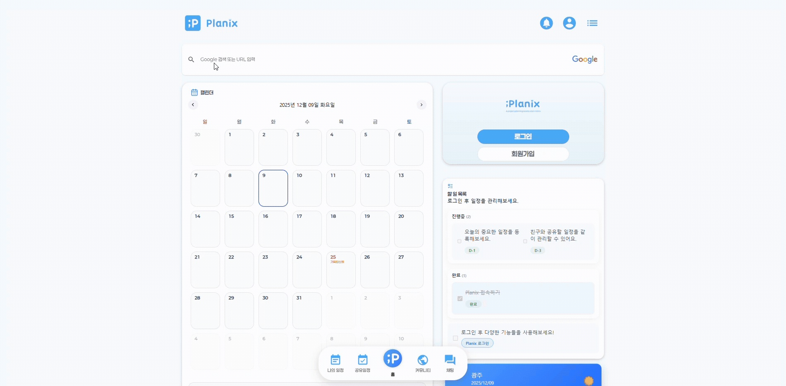</td>
        <td>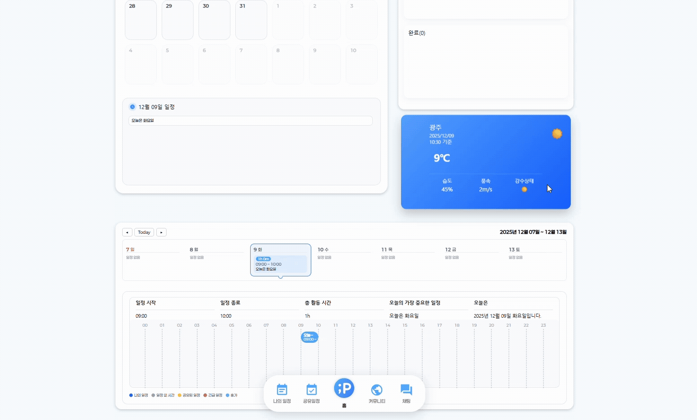</td>
        <td></td>
    </tr>
  </tbody>
</table>

### 2-2. 로그인 및 회원정보 수정

<table>
  <tbody>
    <tr> 
        <td>일반 로그인</td>
        <td>비회원 / 카카오톡 로그인</td>
        <td>회원가입 로그인</td>
        <td>회원정보 수정</td>
    </tr>
    <tr>
        <td>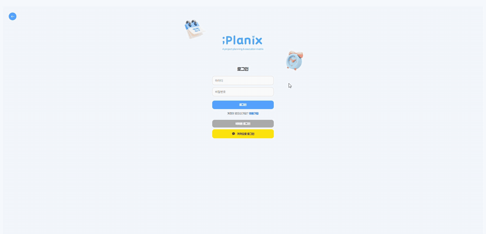</td>
        <td>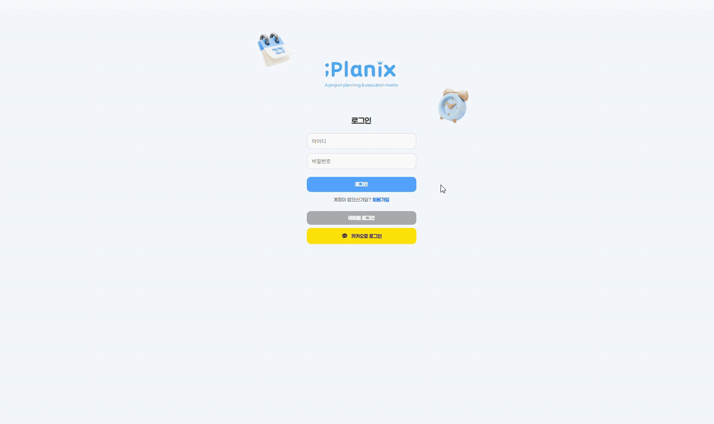</td>
        <td>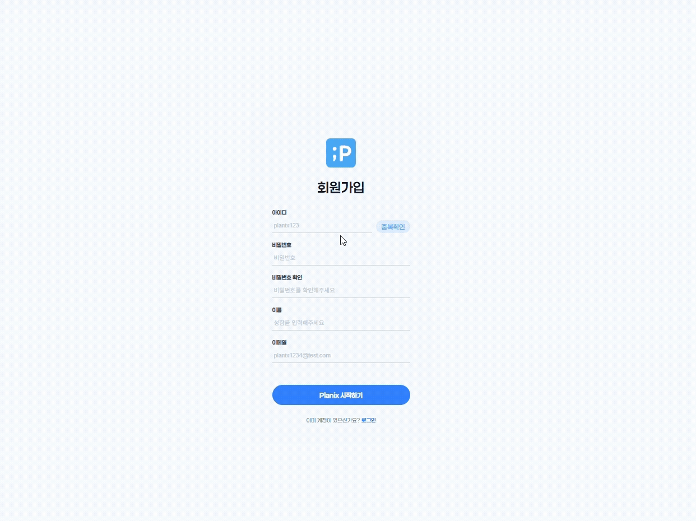</td>
        <td>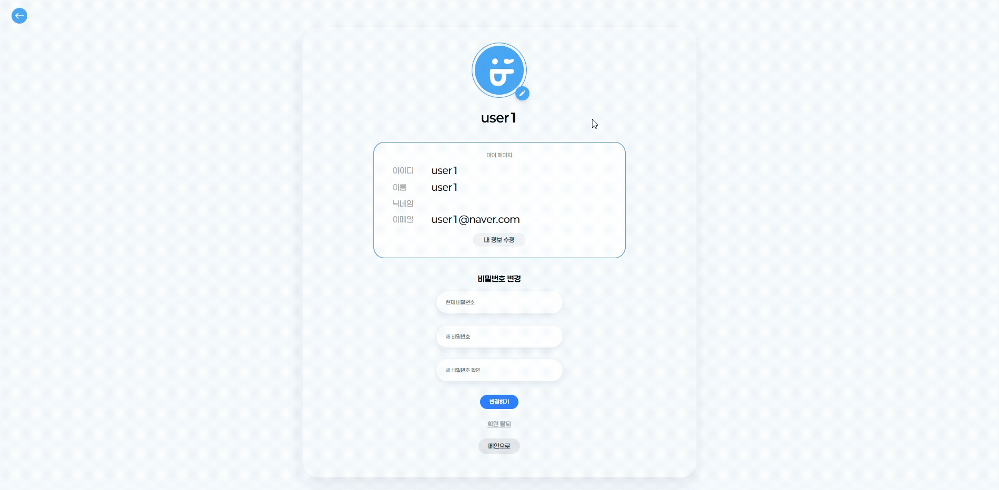</td>
    </tr>
  </tbody>
</table>

### 2-3. 일정 및 스케줄 관리

<table>
  <tbody>
    <tr>
        <td>일정 생성</td>
        <td>Drag & Drop & 스케줄 반영</td>
        <td>수정 및 삭제</td>
        <td>할일 목록을 통한 완료 및 삭제</td>
    </tr>
    <tr>
        <td>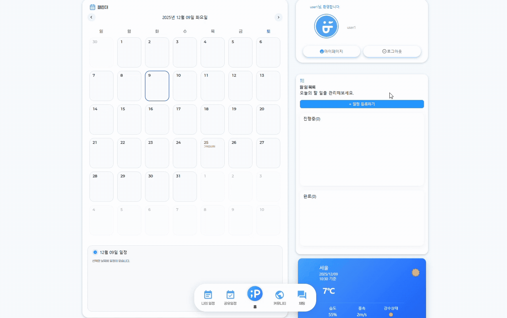</td>
        <td></td>
        <td></td>
        <td>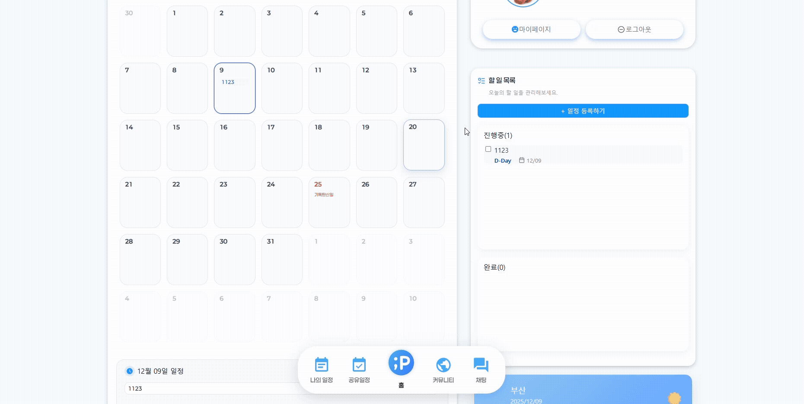</td>
    </tr>
  </tbody>
</table>

### 2-4. 일정/ 공유일정

<table>
  <tbody>
    <tr>
        <td>공유 일정 생성</td>
        <td>공유된 친구의 일정 체크</td>
    </tr>
    <tr>
        <td>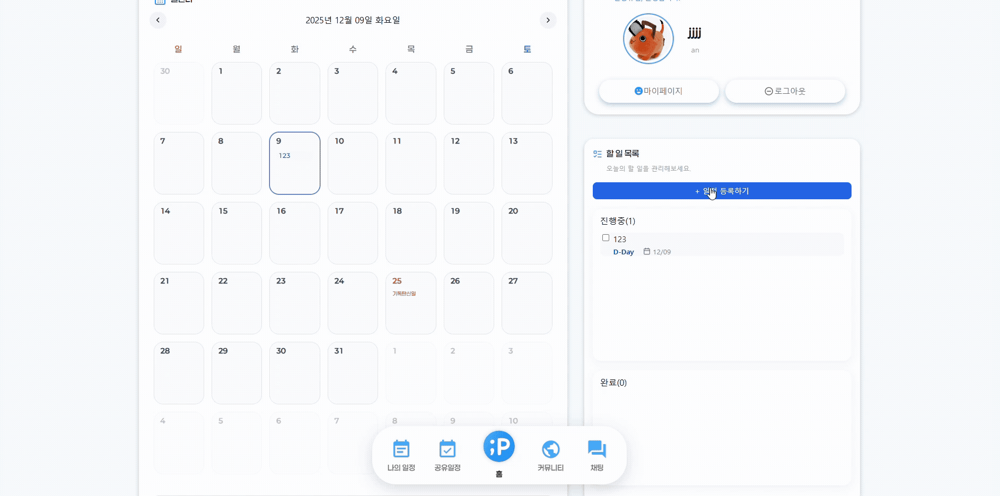</td>
        <td></td>
    </tr>
  </tbody>
</table>

### 2-5. 커뮤니티

<table>
  <tbody>
    <tr>
        <td>커뮤니티 페이지</td>
        <td>일반 게시글 작성</td>
        <td>공지사항 작성</td>
    </tr>
    <tr>
        <td>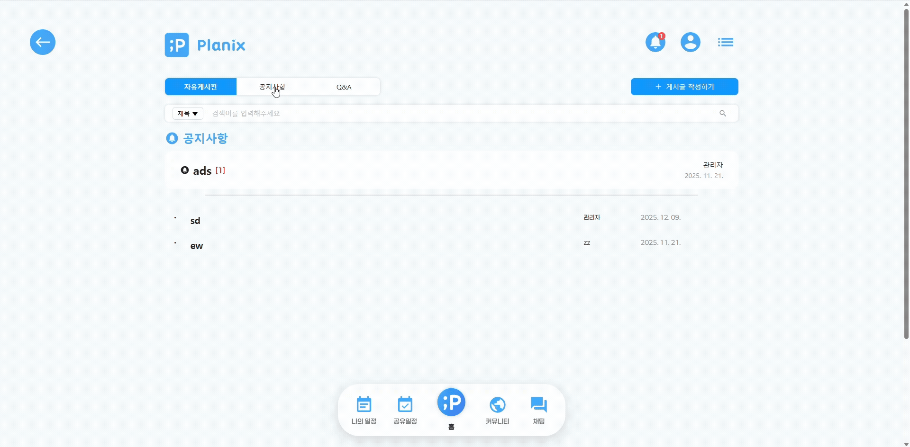</td>
        <td>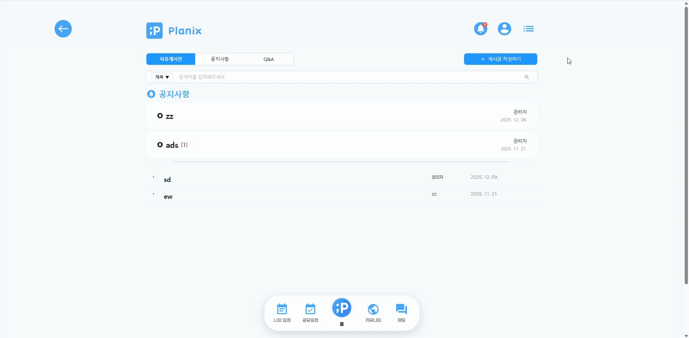</td>
        <td>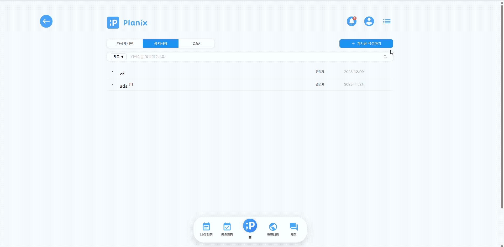</td>
    </tr>
  </tbody>
</table>

### 2-6. 친구관리 / 채팅

<table>
  <tbody>
    <tr>
        <td>채팅 페이지</td>
        <td>친구추가 및 삭제</td>
        <td>일반 대화</td>
        <td>그룹 대화</td>
    </tr>
    <tr>
        <td>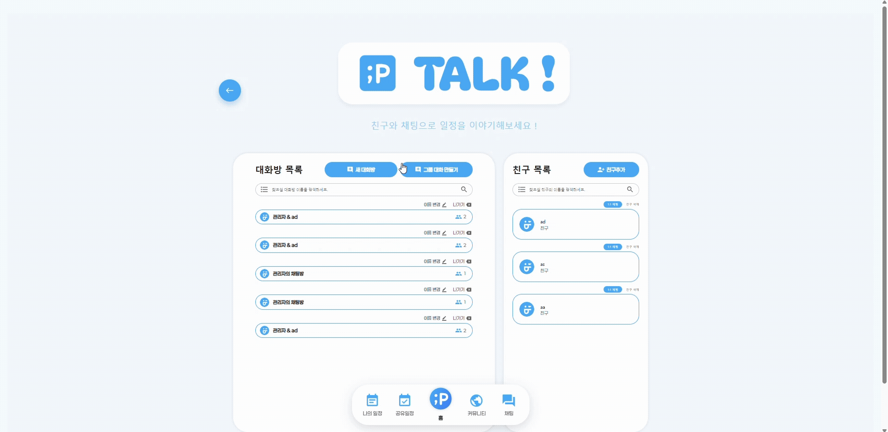</td>
        <td>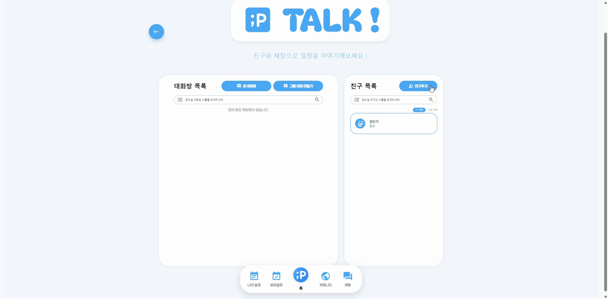</td>
        <td></td>
        <td>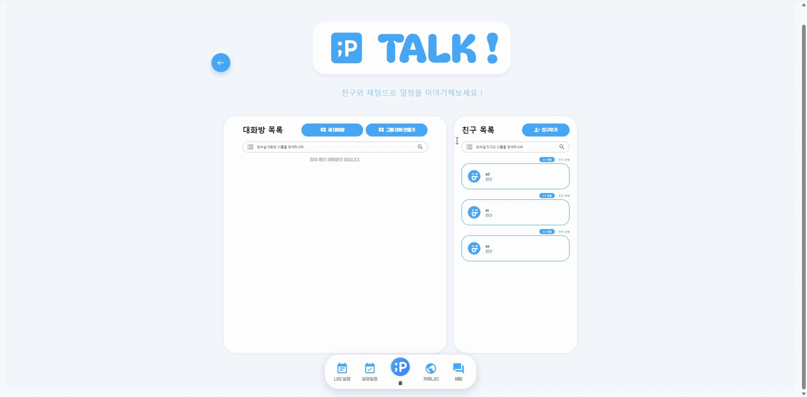</td>
    </tr>
  </tbody>
</table>

### 2-7 관리자 모드

<table>
  <tbody>
    <tr>
        <td>관리자 모드</td>
    </tr>
    <tr>
        <td>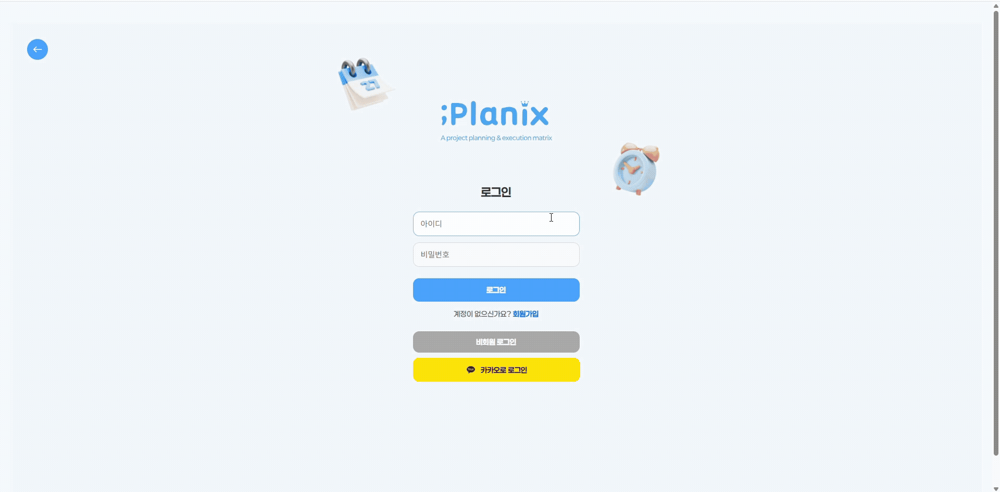</td>
    </tr>
  </tbody>
</table>

---

## <span id="3">3. 개발환경 및 기술스택 🛠️</span>

<div align="center">

### 🧩 Frontend


### ☘ Backend


<!-- 필요하면 기타 기술도 아래에 추가 가능 (캐시, 리트라이 등)


-->

### 🐧 Collaboration & Communication


### 🦭 Deployment

<!-- 실제로 사용한 배포 환경만 남겨 주세요. 아래는 예시입니다. -->
<!--


-->
</div>

---

## <span id="4">4. 화면 구성 💻</span>

### 📂 전체 플로우

```text
비회원 / 로그인
 ├─ 비회원 모드 (제한된 기능)
 └─ 로그인 (일반 / 카카오)
      └─ 메인 대시보드
          ├─ 오늘 / 주간 일정 · 할 일 요약
          ├─ 검색 API (장소·정보 검색)
          ├─ 날씨 위젯
          └─ 카카오 지도 (위치 기반 기능)

메인 대시보드
 ├─ 캘린더 / 스케줄 관리
 │    ├─ 일정 생성 / 수정 / 삭제
 │    ├─ Drag & Drop 으로 일정 시간 변경
 │    ├─ 실시간 스케줄 반영
 │    └─ 개인 Todo 완료 / 삭제
 ├─ 일정 / 공유 일정
 │    ├─ 개인 일정 / 공유 일정 분리 생성
 │    ├─ D-Day 표시
 │    └─ 공유된 친구 일정 확인
 ├─ 커뮤니티
 │    ├─ 일반 게시글 / 공지사항 작성
 │    ├─ 게시글 조회 / 댓글
 │    └─ 게시글 수정 / 삭제
 ├─ 친구 관리 / 채팅
 │    ├─ 친구 추가 / 삭제
 │    ├─ 1:1 채팅
 │    └─ 그룹 채팅
 └─ 마이페이지 / 관리자
      ├─ 회원정보 수정 (닉네임, 비밀번호 등)
      └─ 관리자 모드 (회원 관리, 게시글 관리 등)
```

---

## <span id="5">5. 프로젝트 산출물 📦</span>

### 5-1. ERD (DB 설계)

<p align="center">
  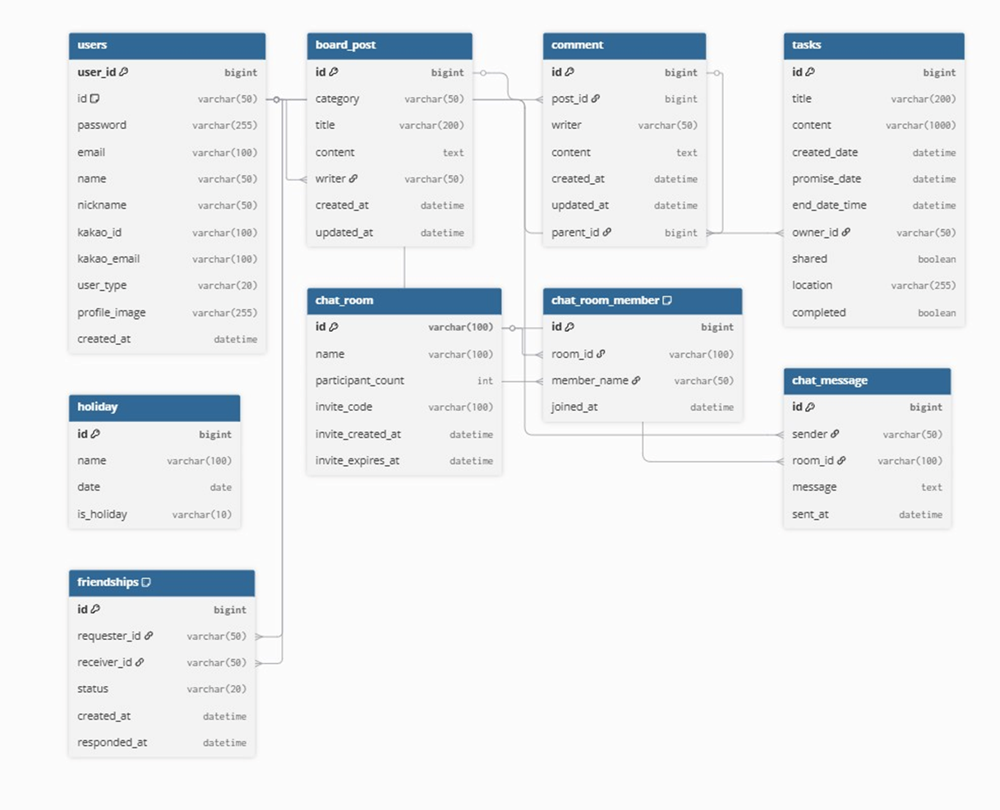
</p>

#### 📘 E-R Dia 요약

- **users** : 서비스 회원 계정을 관리하는 핵심 엔티티
    - 로그인 계정(`id`, `password`)과 프로필 정보(`email`, `name`, `nickname`, `profile_image` 등)을 저장
    - `user_type`을 통해 일반회원 / 관리자 / 카카오 연동 계정을 구분

- **tasks** : 개인 및 공유 일정을 관리하는 엔티티
    - 할 일 제목과 내용(`title`, `content`), 생성일(`created_date`), 마감일(`promise_date`)을 저장
    - `owner_id`(= `users.id`)로 일정 소유자를 식별하고, `shared` / `completed`로 공유 여부와 완료 여부를 관리

- **board_post / comment** : 게시판과 댓글(대댓글)을 관리하는 엔티티
    - `board_post`는 공지·자유·Q&A 등 게시글(`category`, `title`, `content`, `writer` 등)을 관리
    - `comment`는 각 게시글에 대한 댓글을 관리하며, `parent_id`를 이용해 대댓글 계층 구조를 표현

- **chat_room / chat_room_member / chat_message** : 실시간 채팅 기능을 위한 엔티티
    - `chat_room`은 채팅방 정보(`id`, `name`, `participant_count`, 초대코드 등`)를 관리
    - `chat_room_member`는 방별 참여자 목록(`room_id`, `member_name`, `joined_at`)을 관리
    - `chat_message`는 각 방에서 주고받은 메시지(`sender`, `room_id`, `message`, `sent_at`)를 기록

- **friendships** : 사용자 간 친구 관계를 관리하는 엔티티
    - `requester_id`와 `receiver_id`(모두 `users.id`)를 통해 유저–유저 관계를 표현
    - `status`(PENDING, ACCEPTED, REJECTED 등)와 `created_at`, `responded_at`으로 친구 신청 상태를 관리

- **holiday** : 공휴일 정보를 관리하는 엔티티
    - 휴일 이름(`name`), 날짜(`date`), 공휴일 여부(`is_holiday`)를 저장하여 일정 화면에서 참고용으로 사용

**주요 관계**

- 한 명의 사용자(`users`)는 여러 일정(`tasks`), 게시글(`board_post`), 댓글(`comment`), 채팅 메시지(`chat_message`)를 가질 수 있음 (**1:N 관계**)
- `friendships`를 통해 사용자(`users`) 간 **N:N 친구 관계**를 중간 테이블로 표현
- `chat_room`과 `chat_room_member`, `chat_message`는 **1:N 관계**로 채팅방별 참여자와 메시지 이력을 관리

#### 🌳 5-3. 협업 도구 – Sourcetree 활용
<p align="center"> 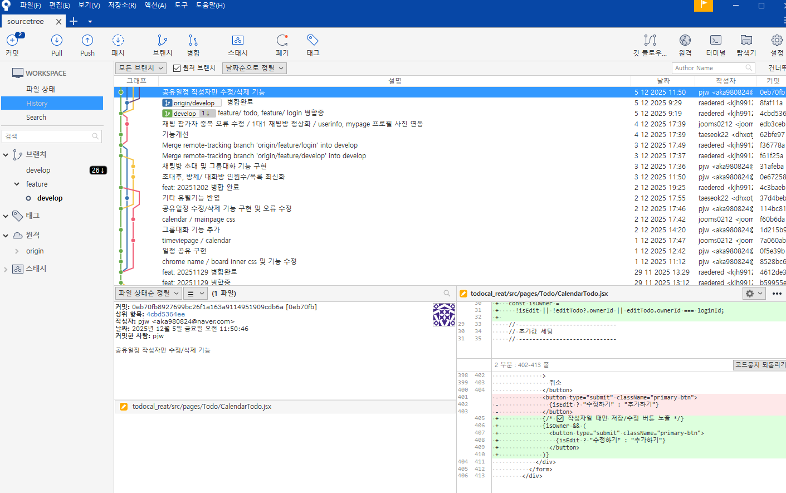 </p>

Git 명령어 대신 Sourcetree GUI를 사용해 브랜치, 커밋, 머지 과정을 직관적으로 관리했습니다.

기능 단위로 커밋을 쌓고, 커밋 그래프를 통해 변경 이력과 병합 흐름을 시각적으로 확인하면서 작업했습니다.

원격 저장소(GitHub)와의 Push / Pull / Fetch 작업을 Sourcetree에서 수행하여, 팀원 간 코드 동기화를 관리했습니다.

변경 파일 비교, 커밋 메시지 작성, 간단한 충돌 해결 등도 Sourcetree 화면에서 처리해 작업 흐름을 정리했습니다.
---

## <span id="6">6. 컨벤션 📐</span>

### 📝 커밋 컨벤션


- ### Backend (Java / Spring)
```text
클래스명: 파스칼 케이스 예) UserService, ChatRoomController

메서드/변수명: 카멜 케이스 예) getUserInfo, chatRoomId

상수: 대문자 + 언더바(_) 예) DEFAULT_PAGE_SIZE

DTO

요청 DTO: SomethingRequestDto

응답 DTO: SomethingResponseDto
```

- ### Frontend (React)

```text
컴포넌트: 파스칼 케이스 예) ChatPage.jsx

일반 함수/변수: 카멜 케이스 예) fetchUserList, userName

API 요청 함수: xxxReq 접미사 예) loginReq, createRoomReq

이벤트 핸들러: onXxxHandler 예) onClickLoginHandler, onChangeInputHandler
```
- ### 기타
```text
한 파일에는 하나의 주 책임(SRP)을 가지도록 구성

불필요한 콘솔 로그/주석은 PR 전 제거

공통 스타일 / 공통 컴포넌트는 별도 디렉토리로 분리
```
